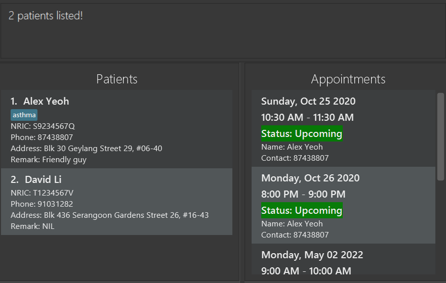
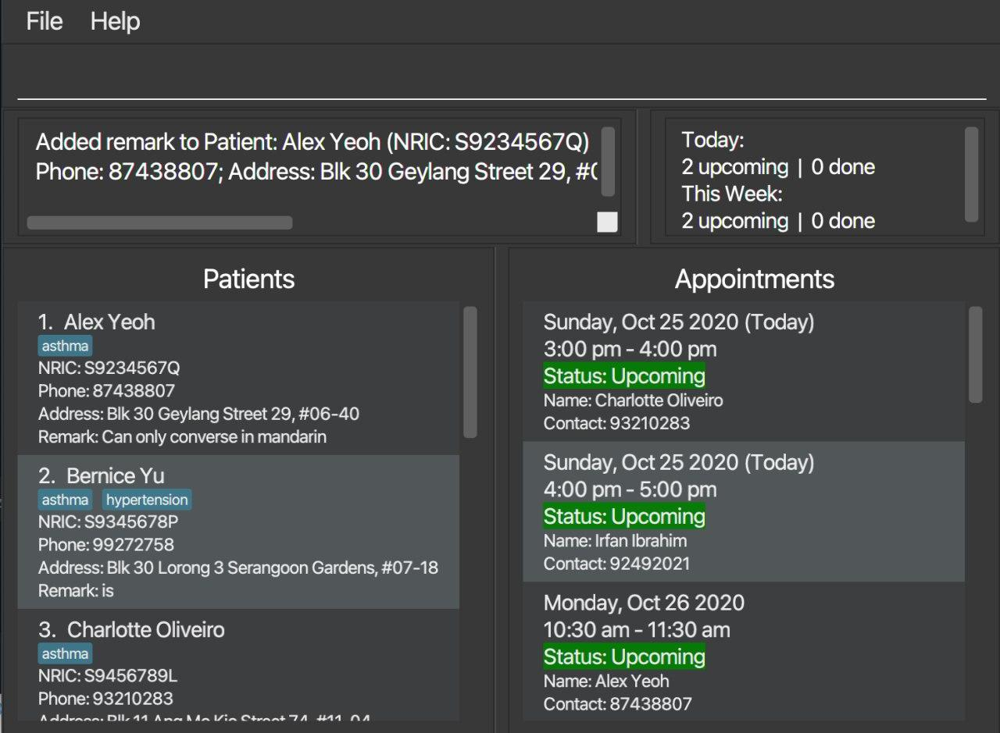
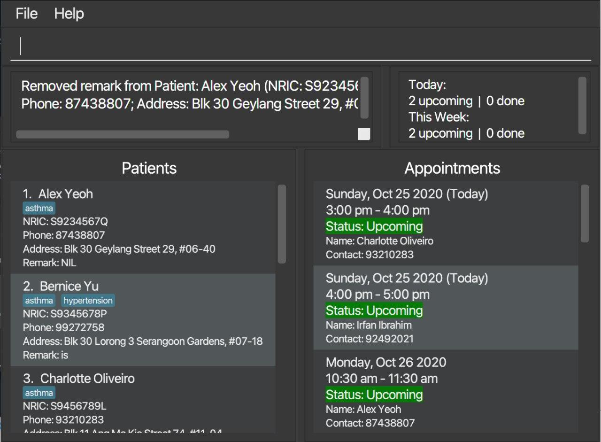

---
layout: page
title: User Guide
---

Nuudle is a **desktop app for managing patient records and clinic appointments, optimized for use via a Command Line Interface (CLI)** while still having the benefits of a Graphical User Interface (GUI). If you can type fast, Nuudle can get your patient and appointment scheduling tasks done faster than traditional GUI apps.

* Table of Contents
{:toc}

--------------------------------------------------------------------------------------------------------------------

## Quick start ( Coming Soon )

1. Ensure you have Java `11` or above installed in your Computer.

1. Download the latest `nuudle.jar` from **here** ( Coming Soon ).

1. Copy the file to the folder you want to use as the _home folder_ for Nuddle.

1. Double-click the file to start the app. The GUI similar to the below should appear in a few seconds. Note how the app contains some sample data. 
   

1. Type the command in the command box and press Enter to execute it. e.g. typing **`help`** and pressing Enter will open the help window. 
   Some example commands you can try :

   * **`list`** : Lists all patients.

   * **`add`**`add n/John Doe i/S9730284G p/98765432 a/John street, block 123, #01-01` : Adds a patient named `John Doe` to the Patient Book.

   * **`delete`**`3` : Deletes the 3rd patient shown in the current list.

   * **`edit`**`1 n/Betsy Crower p/91234567 a/College Avenue 8` : Edits the name, phone number, and address of the 1st patient in the list to be `Betsy`, `91234567`, and `College Avenue 8` respectively.
   * **`find`**`alex david` : Returns `Alex Yeoh`, `David Li` if the two names are found in the list.

   * **`clear`** : Deletes all patients.

   * **`exit`** : Exits the app.

1. Refer to the [Features](#features) below for details of each command.

--------------------------------------------------------------------------------------------------------------------

## Features

**:information_source: Notes about the command format:** 

* Words in `UPPER_CASE` are the parameters to be supplied by the user. 
  e.g. in `add n/NAME`, `NAME` is a parameter which can be used as `add n/John Doe`.

* Items in square brackets are optional. 
  e.g `n/NAME [t/TAG]` can be used as `n/John Doe t/friend` or as `n/John Doe`.

* Items with `…`​ after them can be used multiple times including zero times. 
  e.g. `[t/TAG]…​` can be used as ` ` (i.e. 0 times), `t/friend`, `t/friend t/family` etc.

* Parameters can be in any order. 
  e.g. if the command specifies `n/NAME p/PHONE_NUMBER`, `p/PHONE_NUMBER n/NAME` is also acceptable.

### Viewing help : `help`

Shows a message explaining how to access the help page of Nuudle.

Format: `help`

### Adding a patient : `add`

Adds a patient to the patient book.

Format: `add n/NAME i/NRIC p/PHONE_NUMBER a/ADDRESS [t/TAG]…​`

:bulb: **Tip:**
Tags are used to indicate a patient's underlying medical conditions. A patient can also have any number of tags (including 0).

* Adds a patient with the specified details. 
* The following fields are compulsory and must be provided: `NAME, NRIC, PHONE_NUMBER, ADDRESS`.
* It is optional to add `TAG`s for the patient. Tags can still be added with the edit command upon creating the patient entry in Nuudle.

Examples:
* `add n/John Doe i/S9730284G p/98765432 a/John street, block 123, #01-01`
* `add n/Betsy Crowe i/S9123456G t/friend a/NUS Utown p/1234567 t/asthma`

### Listing all patients : `list`

Shows a list of all patients in the patient book.

Format: `list`

### Editing a patient : `edit`

Edits an existing patient in the patient book.

Format: `edit INDEX [n/NAME] [i/NRIC] [p/PHONE_NUMBER] [a/ADDRESS] [t/TAG]…​`

* Edits the patient at the specified `INDEX`. The index refers to the index number shown in the displayed patient list. The index **must be a positive integer** 1, 2, 3, …​
* At least one of the optional fields must be provided.
* Existing values will be updated to the input values.
* When editing tags, the existing tags of the patient will be removed i.e adding of tags is not cumulative.
* You can remove all the patients' tags by typing `t/` without specifying any tags after it.

Examples:
*  `edit 1 p/91234567 a/College Avenue 8` Edits the phone number and email address of the 1st patient to be `91234567` and `College Avenue 8` respectively.
*  `edit 2 n/Betsy Crower t/` Edits the name of the 2nd patient to be `Betsy Crower` and clears all existing tags.

### Locating patients by name : `find`

Finds patients whose names contain any of the given keywords.

Format: `find KEYWORD [MORE_KEYWORDS]`

* The search is case-insensitive. e.g `hans` will match `Hans`
* The order of the keywords does not matter. e.g. `Hans Bo` will match `Bo Hans`
* Only the name is searched.
* Only full words will be matched e.g. `Han` will not match `Hans`
* Patients matching at least one keyword will be returned (i.e. `OR` search).
  e.g. `Hans Bo` will return `Hans Gruber`, `Bo Yang`

Examples:
* `find John` returns `john` and `John Doe`
* `find alex david` returns `Alex Yeoh`, `David Li` 
  

### Deleting a patient : `delete`

Deletes the specified patient from the patient book.

Format: `delete INDEX`

* Deletes the patient at the specified `INDEX`.
* The index refers to the index number shown in the displayed patient list.
* The index **must be a positive integer** 1, 2, 3, …​

Examples:
* `list` followed by `delete 2` deletes the 2nd patient in the patient book.
* `find Betsy` followed by `delete 1` deletes the 1st patient in the results of the `find` command.

### Adding a remark for a patient : `remark`

Adds a remark to an existing patient in the patient book for nurses to store additional data unique to the patient.

Format: `remark INDEX [r/REMARK]`

:bulb: **Tip:**
We implemented our Remarks feature with the hopes of empowering you with the ability to add extra information to a patient's bio data! 
So don't be shy and feel free to add anything under the sun that you feel apt for the patient. :smile:

* Creates and **adds a remark** for the patient at the specified `INDEX`. The index here refers to the index number shown on the left side of the displayed patient list. 
* Please note that the index used **must be a positive integer** 1, 2, 3, …​
* A remark serves as an **optional field** for adding extra info to a patient's bio data and can be left blank if it is not applicable.
* A patient will have `NIL` displayed as his/her remark status if it was left empty.
* To **override** a remark, simply use the remark/edit command as you would when creating the remark for the patient for the first time with the new remark content.
* If you wish to **delete** the remark for a patient at a specific `INDEX`, simply enter either of the following commands:
    * `remark INDEX`
    * `remark INDEX r/`
    
Examples to add remarks:
*  `remark 2 r/Has been visiting Dr John` Adds a remark `Has been visiting Dr John` to the patient currently displayed second from the top in the patient list.
*  `remark 1 r/Can only converse in mandarin` Adds a remark `Can only converse in mandarin` to the patient currently displayed at the top of the patient list.

 

Examples to delete the remark for a patient at `INDEX` 1:
* `remark 1 r/`
* `remark 1`

 
 

### Adding an appointment : `assign`

Assign the specified patient into the specified appointment date and time.

Format: `assign INDEX d/DATE t/TIME`

* Puts the patient at the specified INDEX into an appointment time slot.
* The INDEX refers to the index number indicated in the patient list.
* The INDEX **must be a positive integer** 1, 2, 3, …​
* The `DATE` and `TIME` of the appointment must be included.
* The timeslot indicated by `DATE` and `TIME` must be available.
* The specified `DATE` and `TIME` must be in the future.

Examples:
* `assign 1 d/Sunday t/2am` books an appointment at the upcoming Sunday, 2am for the 1st patient in the list.
* `assign 3 d/02-03-2021 t/1130` books an appointment on 02/03/2021, 11:30am for the 3rd patient in the list.

### Canceling an appointment : `cancel`

Deletes the specified appointment at the date and time indicated from the appointment book.

Format `cancel d/DATE t/TIME`

* Deletes the appointment at the specified `DATE` and `TIME`.
* The specified `DATE` and `TIME` indicated must take place in the future.
* An appointment with the corresponding `DATE` and `TIME` must exist in the appointment book.

Example:
* `cancel d/02/12/2020 t/10am` deletes the appointment happening on 02/12/2020 10am.
* `cancel 05-Nov-2020 t/1pm` deletes the appointment happening on 05/11/2020 1pm.

### Reschedules an appointment for a patient : `change`

Reschedules or modifies an existing appointment with a new date, time and duration.

Format: `change INDEX d/DATE t/TIME dur/DURATION`

:bulb: **Tip:**
Do note that the duration used here is measured in minutes!

* Reschedules an appointment at the specified `INDEX` for the patient it is tagged to. 
The index here refers to the index number shown on the left side of the displayed appointment list on the right side of the UI. 
* Please note that the index used **must be a positive integer** 1, 2, 3, …
* Please note that the `DATE` and `TIME` used for rescheduling must take place in the future.

* If you wish to **modify** the duration of an existing appointment, simply call the command in the following format:
    * `change 1 d/ORIGINAL_DATE t/ORIGINAL_TIME dur/NEW_DURATION` Extends the duration of the appointment at `INDEX` 1 to the new `DURATION` with the same date and start time.
* If you wish to **reschedule** the appointment with new `DATE`/`TIME`:
    * `change 1 d/NEW_DATE t/ORIGINAL_TIME dur/NEW_DURATION`
    * `change 1 d/ORIGINAL_DATE t/NEW_TIME dur/NEW_DURATION`
    * `change 1 d/NEW_DATE t/NEW_TIME dur/NEW_DURATION`

Examples to reschedule appointments:
*  `change 3 d/02-03-2021 t/1130 dur/30`   Reschedules an appointment at INDEX 3 of the appointment list to 2nd March 2021, 11:30AM with a duration of 30 minutes with it's original patient.
*  `remark 2 d/12-05-2021 t/1530 dur/60`   Reschedules an appointment at INDEX 2 of the appointment list to 12th May 2021, 3:30PM with a duration of 1 hour with it's original patient.

### Listing upcoming appointments by date : `view`

Shows a list of all upcoming appointments entries or only the list of upcoming appointments happening on the specified date.

Format `view [d/DATE]`

* Outputs the list of all upcoming appointments happening on the specified date in chronological order.
* `DATE` must be in the future.
* If `DATE` is not included, outputs the list of all upcoming appointments in chronological order.

Example:
* `view` shows the list of all upcoming appointments in chronological order.
* `view d/4-Aug-2020` shows the list of appointments happening on 04/08/2020.

### Mark an appointment as done : `done`

Marks a specific appointment in the patient book as done.

Format: `done d/DATE t/TIME`

* Marks the appointment with the specified `DATE` and `TIME` as done.
* An appointment with the corresponding `DATE` and `TIME` must exist in the appointment book.

Example:
* `done d/02/12/2020 t/10am` marks the appointment happening on 02/12/2020 10am as completed.
* `done 05-Nov-2020 t/1pm` marks the appointment happening on 05/11/2020 1pm as completed.

### Clearing all appointment entries : `clear`

Clears all appointment entries from the appointment book.

Format: `clear`

### Exiting the program : `exit`

Exits Nuudle.

Format: `exit`

### Saving the data

Patients and appointments data are saved in the hard disk automatically after any command that changes the data. There is no need to save manually.

### Archiving data files `[coming in v2.0]`

Upon starting up the app, past appointments will be automatically archived and saved into separate files. The data files are organised by months for future references.

--------------------------------------------------------------------------------------------------------------------

## FAQ

**Q**: How do I transfer my data to another Computer? 
**A**: Install the app in the other computer and overwrite the empty data file it creates with the file that contains the data of your previous Nuudle home folder.

**Q**: What are the acceptable date time format? 
**A**: Nuudle supports multiple date time formats as well as natural date time language :

Date Formats | Time Formats | Natural Date | Natural Time
:---------------:|:----------------:|:----------------:|:----------------:
02/12/2020 | 2300 | Today | Morning (8AM)
02-12-2020 | 11:00PM | Tomorrow | Noon (12PM)
12/02/2020 | 11PM | Yesterday | Evening (7PM)
12-02-2020 | | Upcoming day of the week | Night (10PM)
2020/12/02 | | | Midnight (11:59PM)
2020-12-02 |
02-Dec-2020 | 
02-December-2020 |
--------------------------------------------------------------------------------------------------------------------

## Command summary

Action | Format, Examples
--------|------------------
**Add** | `add n/NAME i/NRIC p/PHONE_NUMBER a/ADDRESS [t/TAG]…​`   e.g., `add n/James Ho i/S9712345G p/22224444 a/123, Clementi Rd, 1234665 t/asthma t/`
**Delete** | `delete INDEX`  e.g., `delete 3`
**Edit** | `edit INDEX [n/NAME] [p/PHONE_NUMBER] [i/NRIC] [a/ADDRESS] [t/TAG]…`  e.g.,`edit 2 n/James Lee a/College Avenue 8`
**Find** | `find KEYWORD [MORE_KEYWORDS]`  e.g., `find James Jake`
**List** | `list`
**Remark** | `remark INDEX [r/REMARK]` e.g., `remark 2 r/Has been visiting Dr John`, `remark 2`
**Assign** | `assign INDEX d/DATE t/TIME`  e.g., `assign 3 d/tomorrow t/3pm`
**Cancel** | `cancel d/DATE t/TIME`  e.g., `cancel d/today t/4pm`
**Change** | `change INDEX d/DATE t/TIME dur/DURATION`   e.g., `change 3 d/02-03-2021 t/1130 dur/30`
**View** | `view [d/DATE]`  e.g., `view d/today`
**Done** | `done d/DATE t/TIME`  e.g., `done d/23-Aug t/10.30am`
**Clear** | `clear`
**Help** | `help`
**Exit** | `exit`
