---
layout: page
title: User Guide
---

* Table of Contents
{:toc}

--------------------------------------------------------------------------------------------------------------------

## Introduction

Welcome to Nuudle’s User Guide! :smiley:

Looking for a wonderful solution to simplify the complicated process of clinic management? Look no further!

Nuudle is a **desktop app that helps nurses manage patient records and schedule appointments** in an accurate and efficient manner.

We hope that this document will help you in your journey in exploring the wonders of Nuudle app and enhance the way you schedule appointments for your patients.

To begin your journey, head down to our [Quick Start](#quick-start) or explore the various [Features](#features) that we offer. The document will provide you with all the necessary information you need to start your journey!

--------------------------------------------------------------------------------------------------------------------

## About

This document provides you with all necessary information on the installation and complete usage of Nuudle. You can find comprehensive descriptions of all available features in our [Commands](#Commands) section and [Quick Start](#Quick-Start) section will help you with setting up.

The guide also uses the following symbols and formatting:
* Words that looks like [this]() can be clicked to navigate you to the related section of this user guide.
* Words that looks like `this` are words used in commands of Nuudle.
* Words that looks like <kbd>this</kbd> are keys that you can press using your keyboard

*:information_source: This icon is used to indicate additional useful notes and information.* 

*:exclamation: This icon is used to indicate important information.* 

*:bulb: This icon is used to indicate useful tips of Nuudle.* 

--------------------------------------------------------------------------------------------------------------------

## Quick Start

This section provides a step-to-step guide on how to install Nuudle and get it to run on your computer. It also shows the different sections that make up Nuudle's user interface and various sample commands.

Let's get started! :smiley:

### Installing Nuudle

Follow these steps to get started with Nuudle:

1. Ensure you have **Java 11** or above installed in your Computer.

1. Download the latest version of Nuudle from [here](https://github.com/ay2021s1-cs2103t-t12-4/tp/releases).

1. Copy the file to the folder you want to use as the _home folder_ for Nuddle.

1. Double-click the file to start up Nuudle. An application window similar to the one below should appear in a few seconds. 
   Notice how Nuudle also comes with some sample data to get you started. 
   

### Using Nuudle

This section will walk you through the layout of Nuudle. 

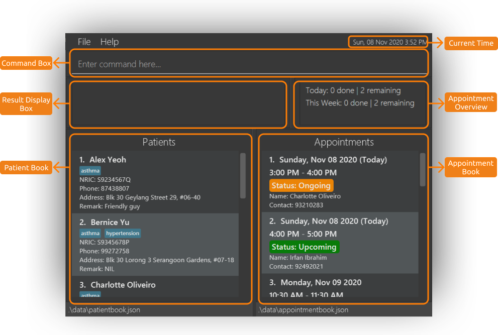

The layout of Nuudle can be divided into 2 main areas:
1. The command execution area
2. The main viewing area

#### Executing command

The command execution area consists of the *Command Box* and the *Result Display Box*.

The *Command Box* is the area where you can type in your command and subsequently execute it by pressing <kbd>Enter</kbd>.
The result from the execution will then be displayed on the *Result Display Box*.

To get you started, here are some sample commands that you can try out:

1. **`help`** : Shows the help window. 

1. **`list`** : Lists all patients.

1. **`add`**` n/John Doe i/S9730284G p/98765432 a/John street, block 123, #01-01` : Adds a patient named `John Doe` to the Patient Book.

1. **`assign`**` 1 d/Tomorrow t/8.30am dur/30` : Creates an appointment for the 1st patient in the patient list for tomorrow 8.30am to 9am, assuming that the time slot is free.

1. **`view`**` d/Tomorrow` : Displays all appointment happening tomorrow.

1. **`cancel`**` 1` : Cancels the first appointment in the displayed appointment list.

1. **`clear`** : Deletes all patients and appointments.

1. **`exit`** : Exits the app.

To learn more about the various commands used in Nuudle, head down to our [Commands](#commands) section.

Alternatively, you can visit our [Command Summary](#command-summary) section to get a quick overview of Nuudle's commands.

#### Viewing the data

The main viewing area consists of the *Patient Book*, the *Appointment Book* and the *Appointment Overview*.

* The *Patient Book* contains information about the patients stored in Nuudle. Here we take a look at an entry in the Patient Book.
  
  
  * The *Patient Index* is a numbering system used in the Patient Book, which allows you to easily reference the patient by using the index shown.
  Throughout the document and the application, we use the term `PATIENT_INDEX` to refer to this Patient Index.

  * The *Medical Condition* here is a tag that help nurses easily identify any identified allergy, illness and more.
  This medical condition can be added as a tag when [adding a new patient](#adding-a-patient--add) or by [editing an existing patient](#editing-a-patient--edit).

  * The *Patient Details* are neatly displayed at the bottom for you to easily check and identify a patient.

 
* The *Appointment Book* contains details about the appointments created by Nuudle. Here we take a look at a single entry in the Appointment Book 

  * Similar to the Patient Index, the *Appointment Index* is a numbering system used in the Appointment Book.
  We use the term `APPT_INDEX` to refer to this Appointment Index.

  * Another important part of an appointment is the *Appointment Status*. There are four status types used in Nuudle and the meaning of each status is shown in the table below:

  **Appointment Status** | **Meaning**
  :---------------:|:----------------
   | A completed appointment that is marked as done using the `done` command
   | An uncompleted appointment that will be happening in the future.
   | An appointment that is currently ongoing but is still uncompleted.
   | An appointment that has already passed but is still uncompleted.

  * The *Patient Details* in the appointment entry provides the basic information of the patient, namely the name and the contact number.
  This allows you to easily keep track of who will be coming for the appointment and also call up the patient, if necessary.

 
* Lastly, the *Appointment Overview* provides simple statistics about the appointments stored in Nuudle.

  
  
  With it, you can: 
  * keep track of the total number of expected appointment for the day.
  * stay updated on the remaining number of appointments to be completed for the day.
  * get an estimate on how busy the clinic will be for the week

--------------------------------------------------------------------------------------------------------------------

## Commands

This section introduces the various commands used in Nuudle.

[general commands](#general-commands), [patient management](#patient-management), [command summary](#command-summary)

### Command format

This section introduces the ...

**:information_source: Notes about the command format:** 

* Words in `UPPER_CASE` are the parameters to be supplied by the user. 
  e.g. in `add n/NAME`, `NAME` is a parameter which can be used as `add n/John Doe`.

* Items in square brackets are optional. 
  e.g `n/NAME [t/TAG]` can be used as `n/John Doe t/friend` or as `n/John Doe`.

* Items with `…`​ after them can be used multiple times including zero times. 
  e.g. `[t/TAG]…​` can be used as ` ` (i.e. 0 times), `t/friend`, `t/friend t/family` etc.

* Parameters can be in any order. 
  e.g. if the command specifies `n/NAME p/PHONE_NUMBER`, `p/PHONE_NUMBER n/NAME` is also acceptable.

**:exclamation: Important information about the command parameters** 

* `DATE`

* `TIME`

* `APPT_INDEX` & `PATIENT_INDEX`

### General

#### Viewing help : `help`

Opens a new window which shows the commonly used commands, and a link to access the User Guide.

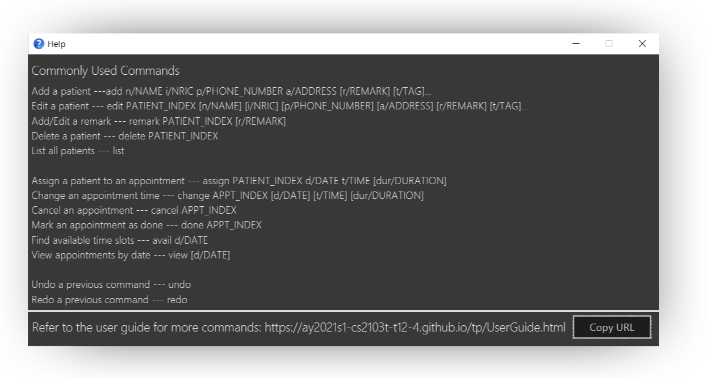

Format: `help`

#### Undoing previous command : `undo`

Restores the patient and appointment book to the state before the previous *undoable* command was executed.
`undo` command cannot reverse a command execution from the previous Nuudle session.
 
Format: `undo`

:information_source: **Tip:**
Undoable commands refers to commands that modifies the patient or appointment list contents. (**add**, **edit**, **delete**, **remark**, **assign**, **change**, **cancel**, **done** and **clear**)

* There must be at least one previously executed undoable command.
* Multiple calls to `undo` will reverse multiple undoable command execution, starting from the most recent command.

Examples:
* `delete 1` 
  `list` 
  `undo` (reverses the `delete 1` command)

* `view d/today` 
  `list` 
  `undo` 
   The `undo` command fails as there is no previous undoable command to reverse.

* `cancel 1` 
  `clear` 
  `undo` (reverses the `clear` command) 
  `undo` (reverses the `cancel 1` command)

Step-by-step illustration:
1. Initial state:  

2. Input `delete 1`:  
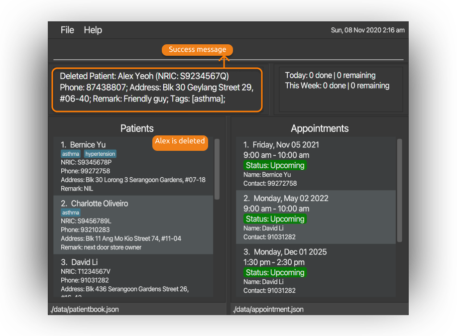  
The first patient `Alex Yeoh` is deleted.

3. Input `undo`:  
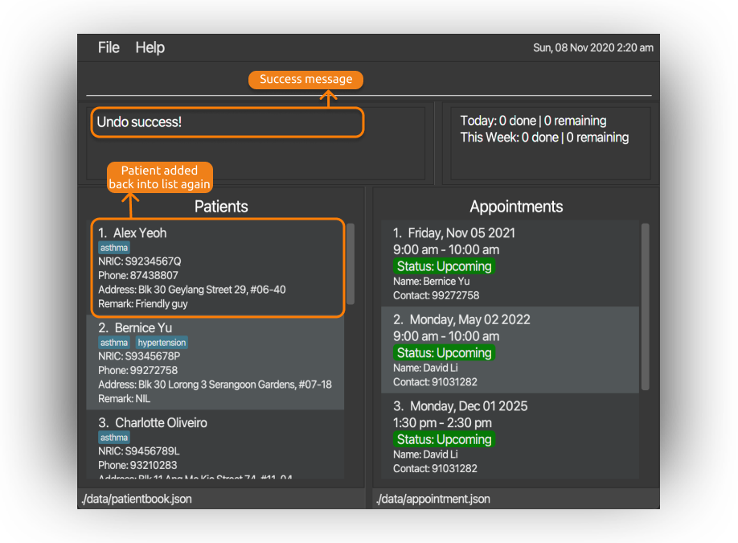  
The `undo` command cancels the last undoable command `delete 1`, so that 
the patient `Alex Yeoh` comes back to the list again.

#### Redoing the previously undone command : `redo`

Reverses the most recent `undo` command. `redo` command cannot reverse an `undo` execution from the previous Nuudle session.

Format: `redo`

* There must be at least one previously executed `undo` command.
* The previously executed `undo` command should be the most recent command that modifies the lists' data.
* Multiple call to `redo` will reverse multiple `undo` command, starting from the most recent `undo` command.

Examples:
* `cancel 1`  
  `undo` (reverses the `cancel 1` command) 
  `list` 
  `redo` (reapplies the `cancel 1` command)

* `cancel 1` 
  `undo` (reverses the `cancel 1` command) 
  `cancel 2` 
  `redo` 
   The `redo` command fails as there are no `undo` commands executed previously.

* `cancel 1` 
  `clear` 
  `undo` (reverses the `clear` command) 
  `undo` (reverses the `cancel 1` command) 
  `redo` (reapplies the `cancel 1` command) 
  `redo` (reapplies the `clear` command)

Step-by-step illustration:
1. Initial state:  

2. Input `clear`:  

3. Input `Undo`:  
  
All the data comes back.

4. Input `Redo`:  
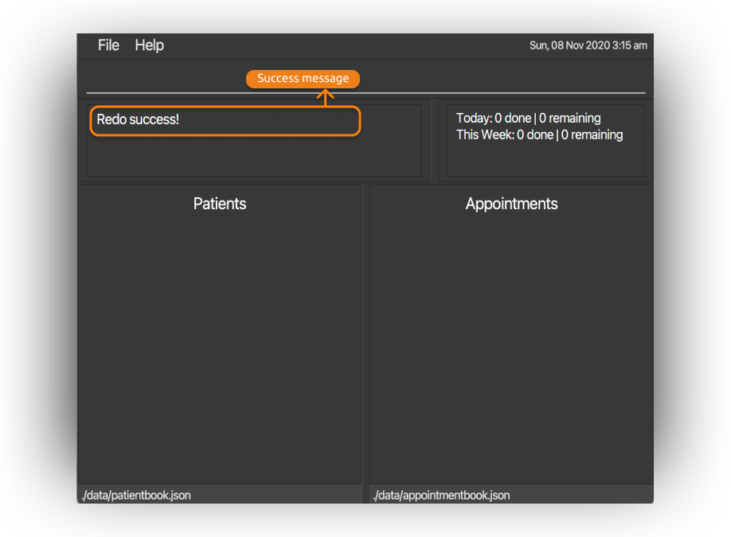  
Redo the `clear` command, which removes all the data again.

#### Clearing all data : `clear`

Clears all appointment and patients entries.

Format: `clear`

Step-by-step illustration: 
1. Suppose you would like to clear the sample data to officially start using Nuudle from scratch, you can simply type in the command `clear` and press <kbd>Enter</kbd>. 
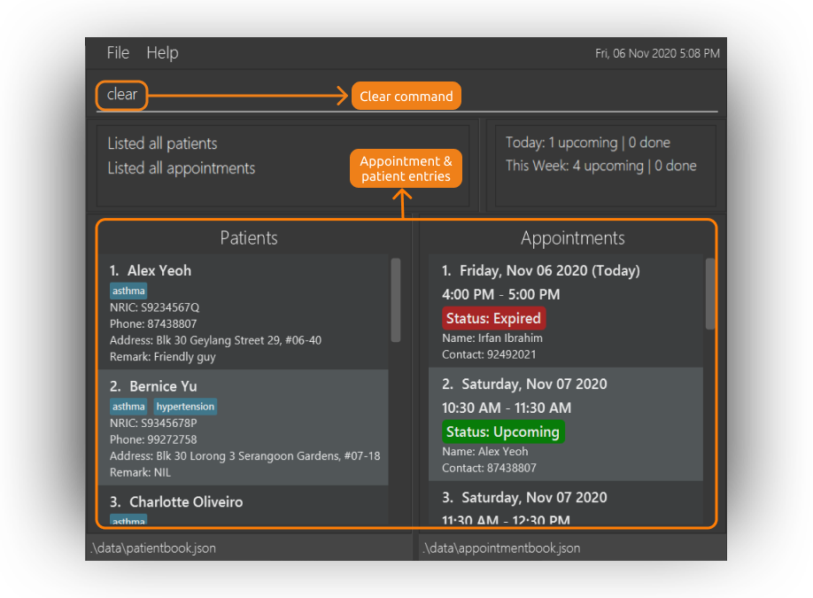

2. All patient and appointment entries are cleared. You can now officially start adding your clinic's patient and appointment entries. 
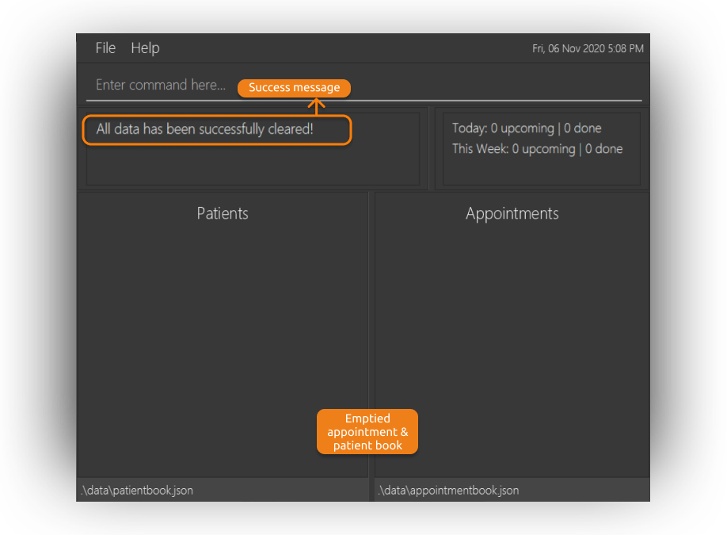

#### Exiting the program : `exit`

Exits Nuudle.

Format: `exit`

#### Retrieving previously entered commands

By pressing the <kbd>↑</kbd> and <kbd>↓</kbd> arrow keys in the command box, you can cycle through the previously executed commands.

:bulb: **Tip:** You can use this feature together with `undo` command to correct a wrongly executed command. The steps below illustrate how this correction can be done: 

1. Use the `undo` command to first reverse the previous command execution. 

2. Next, use the <kbd>↑</kbd> arrow key in the command box to retrieve the original command. 

3. You can then edit the original command and execute it by pressing the <kbd>Enter</kbd> key. 

 
With this feature, it saves you the hassle of having to retype the whole command again!

#### Saving the data

Nuudle automatically saves the patient and appointment data to your home folder after any changes are made to the data. There is no need for you to save manually.

#### Archiving past appointments

Nuudle automatically removes past appointments and saves them into an archive folder for your future reference. This is done automatically everytime you start up the Nuudle app.

The appointments are grouped by their appointment months and saved in respective Comma-Separated Values (CSV) files. These files can be opened and viewed using Excel.

#### Backing up the data

Nuudle also keeps a backup of your data files from the previous Nuudle session in a backup folder. The backup data will be updated everytime you start up the Nuudle app.

This backup allows you to completely revert your data to the previous session's data. This is especially useful if your data was unintentionally corrupted and you need to manually restore the data.

--------------------------------------------------------------------------------------------------------------------
### Patient Management

#### Adding a patient : `add`

Adds a patient to the patient book.

Format: `add n/NAME i/NRIC p/PHONE_NUMBER a/ADDRESS [r/REMARK] [t/TAG]…​`

:bulb: **Tip:**
Tags are used to indicate a patient's underlying medical conditions. A patient can have any number of tags (including 0).

* Adds a patient with the specified details.
* The following fields are compulsory and must be provided: `NAME, NRIC, PHONE_NUMBER, ADDRESS`.
* It is optional to add `TAG`s for the patient. Tags can still be added with the edit command upon creating the patient entry in Nuudle.

Examples:
* `add n/John Doe i/S9730284G p/98765432 a/John street, block 123, #01-01`
* `add n/Betsy Crowe i/S9123456G t/friend a/NUS Utown p/1234567 t/asthma`

Step by step illustration:
1. Enter `add n/Nuudle Numberone i/S7564832U p/84729741 a/UTown r/first visit` in command box. 
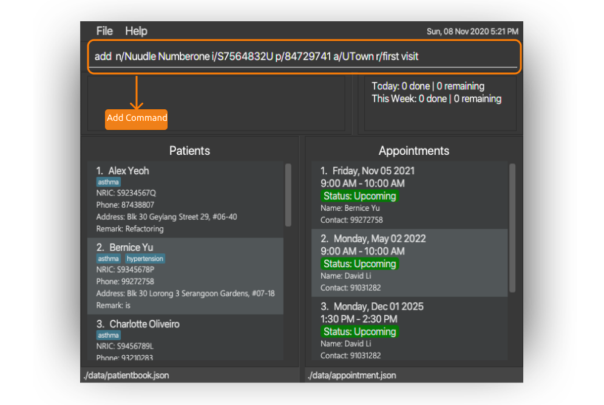

2. The information of the added patient is displayed in the result box.
The patient is now added to the patient book. 
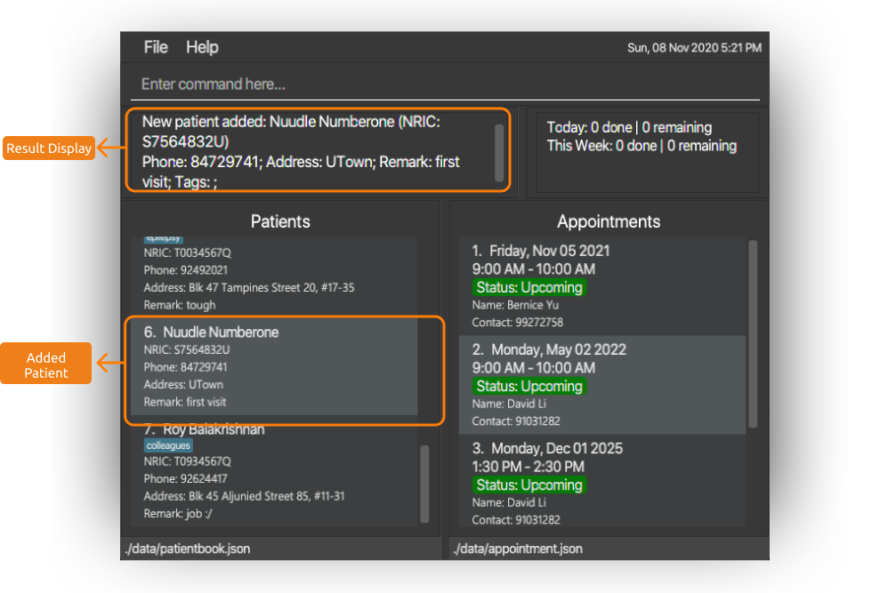

#### Editing a patient : `edit`

Edits a patient's particulars. Existing appointments involving the edited patient will be updated accordingly.

Format: `edit PATIENT_INDEX [n/NAME] [i/NRIC] [p/PHONE_NUMBER] [a/ADDRESS] [r/REMARK] [t/TAG]…​`

* Edits the patient at the specified `PATIENT_INDEX`.
* At least one of the optional fields must be provided to execute the `edit` command.
* The patient's existing particulars will be updated according to the input values.
* When editing tags, the existing tags of the patient will be removed i.e adding of tags is not cumulative.
* You can remove all the patients' tags by typing `t/` without specifying any tags after it.

Examples:
*  `edit 1 p/91234567 a/College Avenue 8` Edits the phone number and email address of the 1st patient to be `91234567` and `College Avenue 8` respectively.
*  `edit 2 n/Betsy Crower t/` Edits the name of the 2nd patient to be `Betsy Crower` and deletes all existing tags.

Step-by-step illustration: 
1. Suppose a patient, Charlotte, changes her phone number from `84812305` to `91234567`, simply type `edit 3 p/91234567` in the command box and press <kbd>Enter</kbd>. 
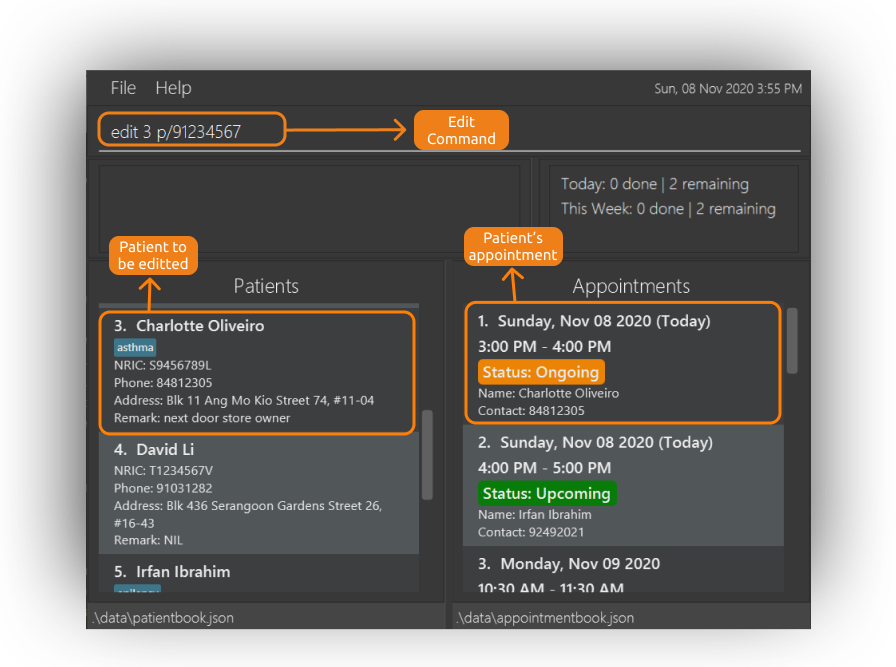

2. Charlotte's phone number is now updated and the change is also reflected in the relevant appointments.
The particulars of the edited patient is displayed in the result display box. 
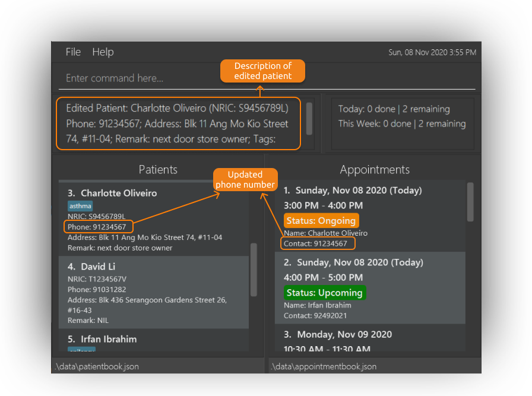

#### Deleting a patient : `delete`

Deletes the specified patient from the patient book.

Format: `delete PATIENT_INDEX`

* Deletes the patient at the specified `PATIENT_INDEX`.
* The index refers to the index number shown in the displayed patient list.
* The index **must be a positive integer** 1, 2, 3, …​
* Deleting a patient will also delete all the appointments of the person.

Examples:
* `list` followed by `delete 2` deletes the 2nd patient in the displayed patient list.
* `find Betsy` followed by `delete 1` deletes the 1st patient in the results of the `find` command.

#### Adding a remark for a patient : `remark`

Adds a remark to an existing patient in the patient book for nurses to store additional data unique to the patient.

Format: `remark PATIENT_INDEX [r/REMARK]`

:bulb: **Tip:**
We implemented our remarks feature to empower you with the ability to add extra information to a patient's bio data!
So don't be shy and feel free to add anything under the sun that is applicable for the patient.

* **Adds a remark** for the patient at the specified `PATIENT_INDEX`.
* `PATIENT_INDEX` here refers to the number shown on the left side of the displayed patient book.
* Please note that the index used **must be a positive integer** 1, 2, 3, …​
* A remark is an **optional field** and can be left blank if it is not applicable.
* A patient will have `NIL` displayed as his/her remark status if it was left empty.
* To **override** a remark, simply use the remark command as described above.
 Alternatively, you can also use the edit command to add or edit remarks if you wish to change multiple fields (eg. Phone number) at the same time.
* If you wish to **delete** a patient's remark, simply use either of the following commands:
    * `remark PATIENT_INDEX`
    * `remark PATIENT_INDEX r/`

Examples to add remarks:
*  `remark 2 r/Has been visiting Dr John` Adds a remark `Has been visiting Dr John` to the patient currently displayed second from the top in the patient list.
*  `remark 1 r/Can only converse in mandarin` Adds a remark `Can only converse in mandarin` to the patient currently displayed at the top of the patient list.

 

Examples to delete the remark for a patient at index 1:
* `remark 1 r/`
* `remark 1`

 

#### Listing all patients : `list`

Shows a list of all patients in the patient book.

Format: `list`

#### Locating patients by name : `find`

Finds patients by name, NRIC or phone numbers.

Format: `find [n/NAME [MORE_NAMES]] [i/NRIC [MORE_NRICS]] [p/PHONE_NUMBER [MORE_PHONE_NUMBERS]] `

* The search is case-insensitive. e.g `hans` will match `Hans`
* The order of the keywords does not matter. e.g. `Hans Bo` will match `Bo Hans`
* Only the name, NRIC, and phone number are searched.
* Only full words will be matched e.g. `Han` will not match `Hans`
* Patients matching at least one keyword will be returned (i.e. `OR` search).
  e.g. `Hans Bo` will return `Hans Gruber`, `Bo Yang`
* The respective appointments of patients matching at least one keyword will also be returned.
* The search requirements cannot be left empty, at least one search requirement (by name, NRIC, or phone number) has to be provided

Examples:
* `find n/John` returns patients whose name contains `john`.
* `find n/alex p/99998888 i/S1234567I` returns patients whose name contains `Alex`, or whose phone number is `99998888`, or whose NRIC number is `S1234567I`. 

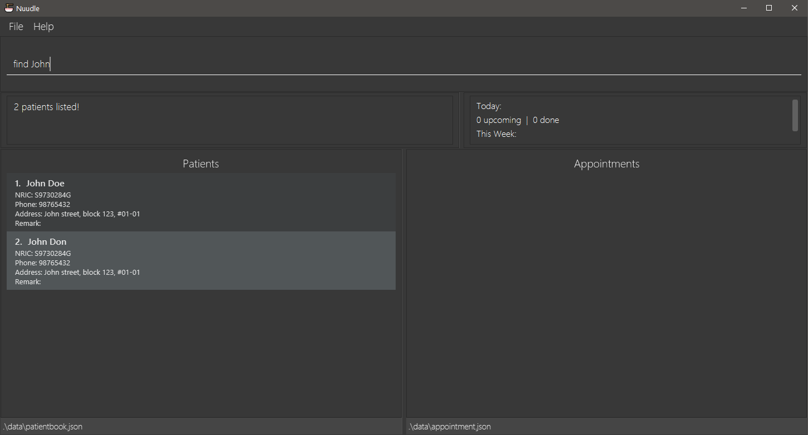

--------------------------------------------------------------------------------------------------------------------
### Appointment Management

#### Adding an appointment : `assign`

Assigns the specified patient into the specified appointment date and time.

Format: `assign PATIENT_INDEX d/DATE t/TIME [dur/DURATION]`

* Puts the patient at the specified `PATIENT_INDEX` into an appointment time slot.
* The `PATIENT_INDEX` refers to the index number indicated in the patient list.
* The `PATIENT_INDEX` **must be a positive integer** 1, 2, 3, …​
* The `DATE` and `TIME` of the appointment must be included.
* The `DURATION` is measured in minutes and will be defaulted to 60 minutes if omitted.
* The time slot indicated by `DATE` and `TIME` must be available.
* The specified `DATE` and `TIME` must be in the future.

Examples:
* `assign 1 d/Sunday t/2pm dur/40` books an appointment of 40 minutes on the upcoming Sunday, 2am for the 1st patient in the list.
* `assign 3 d/02-03-2021 t/1130` books an appointment of 60 minutes on 02/03/2021, 11:30am for the 3rd patient in the list.

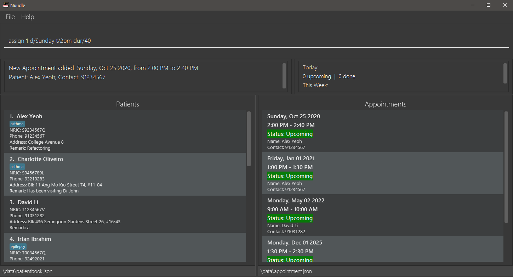

#### Reschedules an appointment for a patient : `change`

Reschedules or modifies an existing appointment with a new date, time or duration.

Do note that the duration used here is **measured in minutes** and must be **at least 10 minutes**!

Format: `change APPT_INDEX [d/DATE] [t/TIME] [dur/DURATION]`

:bulb: **Tip:**
If you would only like to change the duration of an appointment while keeping it's original date and time, simply
enter the new `DURATION` with it's corresponding `APPT_INDEX`! There is no need to retype it's date and time. The same
applies for the other fields.

* **Reschedules an appointment** at the specified `APPT_INDEX` for the patient it is tagged to.
* The `APPT_INDEX` refers to the number shown in the displayed appointment book located on the right side of the UI.
* Please note that the index used **must be a positive integer** 1, 2, 3, …
* Please note that the `DATE` and `TIME` used for rescheduling must be set in the future.
* **At least one** of the optional fields must be present for a successful execution of the change command.

* If you wish to **modify** the duration of an existing appointment, simply call the command in the following format:
    * `change 1 dur/NEW_DURATION`:  Extends the duration of the first appointment at `APPT_INDEX` 1 to the `NEW_DURATION` with the same date and start time.

* Some examples of **rescheduling** an appointment with a new `DATE`,`TIME` or `DURATION`:
    * `change 1 d/NEW_DATE dur/NEW_DURATION`:  Reschedules an appointment to the `NEW_DATE` with the `NEW_DURATION` at it's original `TIME`.
    * `change 1 t/NEW_TIME dur/NEW_DURATION`:  Reschedules an appointment to the `NEW_TIME` with the `NEW_DURATION` at it's original `DATE`.
    * `change 1 d/NEW_DATE t/NEW_TIME dur/NEW_DURATION`:  Reschedules an appointment to the `NEW_DATE` and `NEW_TIME` with the `NEW_DURATION`.
* Any other combinations of the optional fields are supported as well.

Examples to reschedule appointments:
*  `change 3 d/02-03-2021`   Reschedules the 3rd appointment in the appointment book to 2nd March 2021 with it's time, duration and patient.
*  `change 2 d/12-05-2021 t/1530 dur/60`   Reschedules the 2nd appointment in the appointment list to 12th May 2021, 3:30PM with a duration of 1 hour with it's original patient.

#### Canceling an appointment : `cancel`

Cancels the specified appointment and removes it from the appointment book.

Format `cancel APPT_INDEX`

Example:
* `view` followed by `cancel 2` deletes the 2nd appointment in the displayed appointment list.
* `view d/today` followed by `cancel 1` deletes the 1st appointment happening on today's date (if it exists).

Step-by-step illustration: 
1. Suppose a patient calls to cancel his 10.30am appointment tomorrow, first get all the appointments for tomorrow by using the `view t/tomorrow` command. 
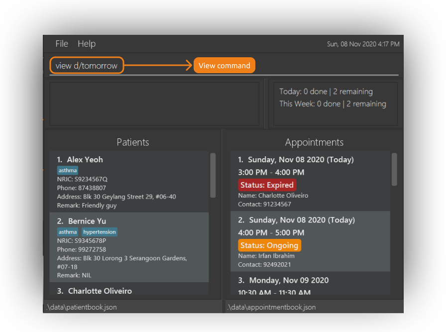

2. Next, look for the 10.30am appointment and cancel it using the `cancel` command.
Here, we use `cancel 1` as the appointment to cancel is the first appointment in the book. 
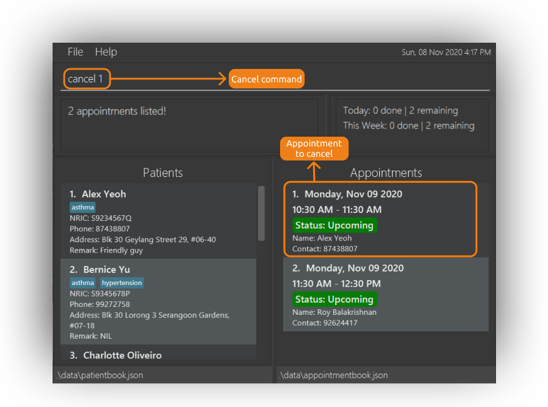

3. The 10.30am appointment is cancelled and removed from the appointment book.
The cancelled appointment details is also displayed in the result display box. 
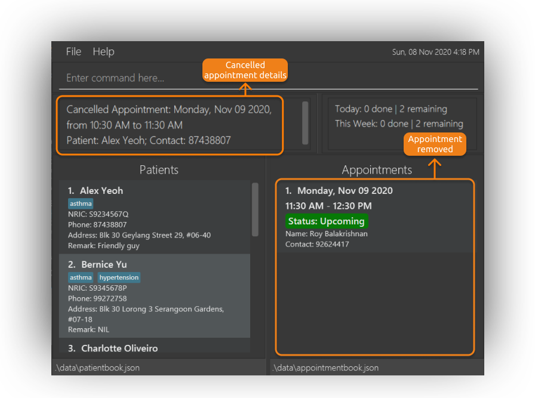

#### Marking an appointment as done : `done`

Marks a specific appointment in the patient book as done.

Format: `done APPT_INDEX`

* Marks the appointment at the specified `APPT_INDEX` as done.
* The `APPT_INDEX` refers to the index number indicated in the displayed appointment list.
* The `APPT_INDEX` **must be a positive integer** 1, 2, 3, …​
* The indicated appointment should be an appointment that has not been marked before.

Example:
* `done 3` marks the 3rd appointment in the displayed appointment list as completed.
* `view d/today` followed by `done 1` marks the 4th appointment happening on today's date as completed.

Step by step illustration:
1. Enter `done 1` in command box  
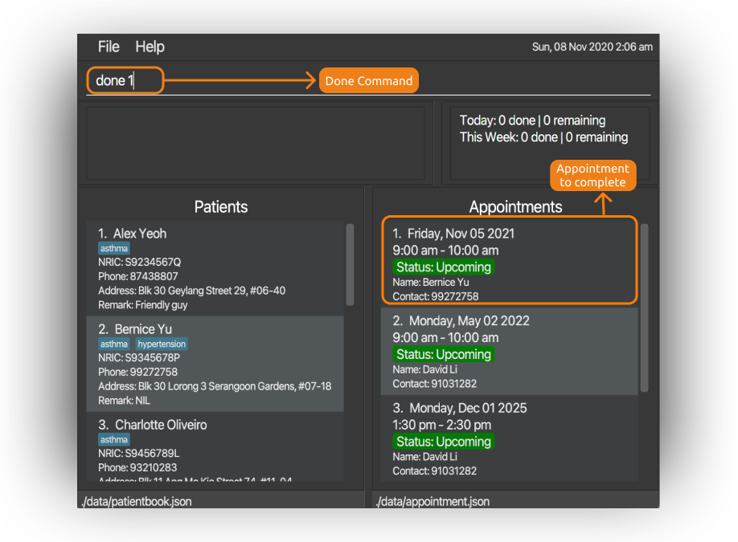

2. The result display box shows the success message and the appointment is marked as down  
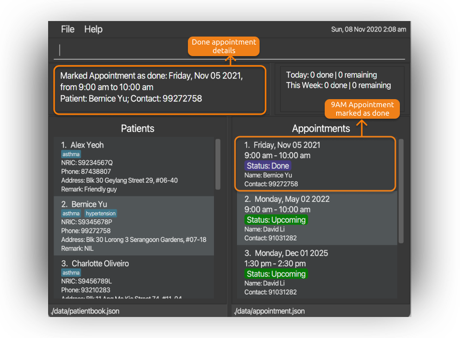

#### Listing upcoming appointments by date : `view`

Shows a list of all upcoming appointments entries or only the list of upcoming appointments happening on the specified date.

Format `view [d/DATE]`

* Outputs the list of all upcoming appointments happening on the specified date in chronological order.
* The specified `DATE` must be in the future.
* If `DATE` is not specified, `view` will output the list of **all** upcoming appointments in chronological order.

Example:
* `view` shows the list of all upcoming appointments in chronological order.
* `view d/4-Aug-2020` shows the list of appointments happening on 04/08/2020.

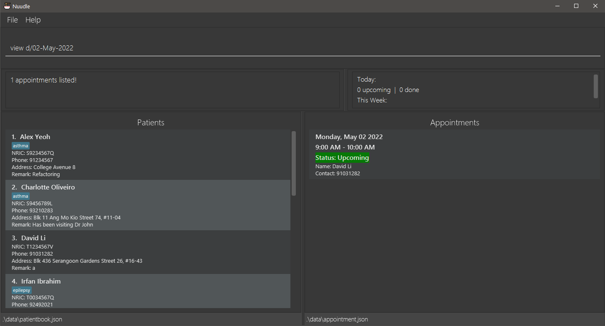

#### Listing available time slots by date : `avail`

Shows a list of all available (free) time slots within the operation time of the clinic on a specified date. 
The earliest available time slot on the specified date is also provided.

Format: `avail d/DATE`

* Outputs the list of all available time slots within the operation time of the clinic on a specified date in chronological order.
* The earliest available time slot within the operation time of the clinic on a specified date will also be displayed.
* `DATE` must be today or in the future.
* Do note that the earliest available time slot will not be provided when `avail d/today` is executed after clinic's operation hour.

Example:
* `avail d/4-Aug-2020` shows the list of all available (free) time slots within the operation time of the clinic on 04/08/2020.
* `avail d/today` shows the list of all available (free) time slots within the operation time of the clinic today.

Step by step illustration:
1. Enter `avail d/05-Nov-2021` in command box. 
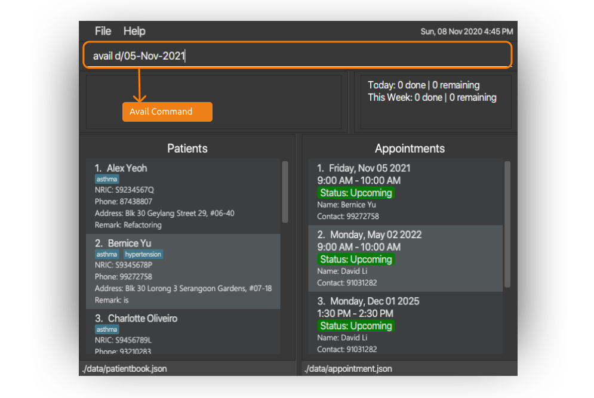

2. The available time slots of the day and the earliest available time slot is displayed in the result box.
The list of appointments on the specified date is also displayed. 
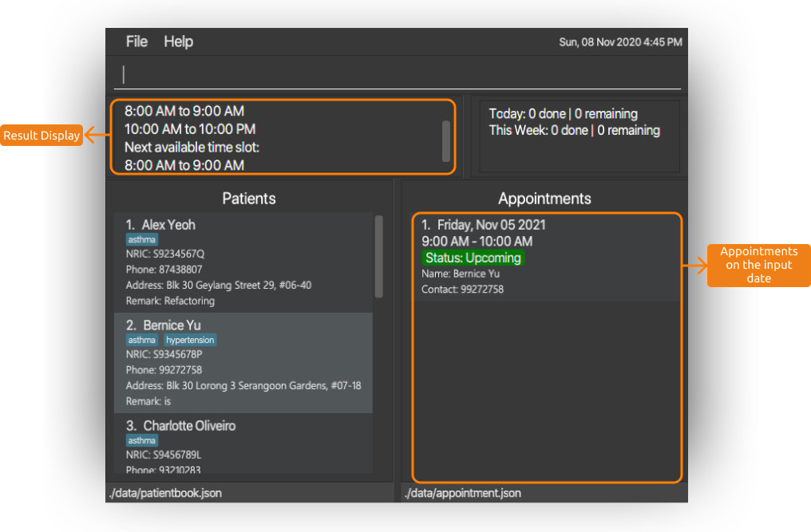

--------------------------------------------------------------------------------------------------------------------
### Command summary
#### General command

Action | Format
-------|----------
**Help** | `help`
**Undo** | `undo`
**Redo** | `redo`
**Clear** | `clear`
**Exit** | `exit`

#### Patient Management

Action | Format | Examples
--------|--------|----------
**Add** | `add n/NAME i/NRIC p/PHONE_NUMBER a/ADDRESS [t/TAG]…​` | `add n/James Ho i/S9712345G p/22224444 a/123, Clementi Rd, 1234665 t/asthma t/`
**Delete** | `delete PATIENT_INDEX`| `delete 3`
**Edit** | `edit PATIENT_INDEX [n/NAME] [p/PHONE_NUMBER] [i/NRIC] [a/ADDRESS] [t/TAG]…`|`edit 2 n/James Lee a/College Avenue 8`
**Find** | `find KEYWORD [MORE_KEYWORDS]`| `find James Jake`
**List** | `list` | `list`
**Remark** | `remark PATIENT_INDEX [r/REMARK]`| `remark 2 r/Has been visiting Dr John`, `remark 2`

#### Appointment Management

Action | Format | Examples
--------|---------|---------
**Assign** | `assign PATIENT_INDEX d/DATE t/TIME`| `assign 3 d/tomorrow t/3pm`
**Cancel** | `cancel APPT_INDEX`| `cancel 1`
**Change** | `change APPT_INDEX d/DATE t/TIME dur/DURATION` | `change 3 d/02-03-2021 t/1130 dur/30`
**View** | `view [d/DATE]`| `view d/today`
**Done** | `done APPT_INDEX`| `done 2`
**Available** | `avail d/DATE`| `avail d/12-Apr-2021`

--------------------------------------------------------------------------------------------------------------------

## FAQ

**Q**: How do I transfer my data to another Computer? 
**A**: Install the application in the other computer and overwrite the empty data folder it creates with the data folder from your previous Nuudle's home folder.

**Q**: What are the acceptable date time format? 
**A**: Nuudle supports multiple date time formats as well as natural date time language :

Date Formats | Time Formats | Natural Date | Natural Time
:---------------:|:----------------:|:----------------:|:----------------:
02/12/2020 | 2300 | Today | Morning (8AM)
02-12-2020 | 11:00PM | Tomorrow | Noon (12PM)
12/02/2020 | 11.00PM | Yesterday | Evening (7PM)
12-02-2020 | 11PM | Upcoming day of the week | Night (10PM)
2020/12/02 | | | Midnight (11:59PM)
2020-12-02 |
02-Dec-2020 |
02-December-2020 |

**Q**: My data was accidentally deleted and I can't undo it. How do I restore my data? 
**A**: You can restore the data from your previous session by following the steps below:
1. Look for a backup file in the data folder of your Nuudle's home folder. 

2. Open the backup file and copy the 2 data files inside.

3. Navigate back to the main data folder in your Nuudle's home folder.

4. Override the current data files in the main data folder by pasting the previously copied files.

5. The previous session's data is now restored and you can access it by starting up the Nuudle application.
